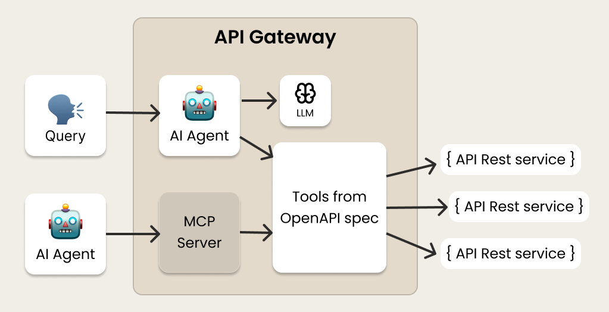

# ai-api-gateway
API Gateway that solves requests by mapping [OpenAPI](https://en.wikipedia.org/wiki/OpenAPI_Specification) specification with [AI Tools](https://docs.spring.io/spring-ai/reference/api/tools.html).

Requests to the API Gateway are infered to the LLM model that determines the API to be called using the set of [AI Tools](https://docs.spring.io/spring-ai/reference/api/tools.html) defined from API Rest services. 




### ✅ Features
- Mapping of OpenAPI specification to AI Tools
- Register of API services in the gateway
- API Rest to invoke the gateway
- Support to [MCP protocol](https://github.com/modelcontextprotocol)

### 🧩 Components
#### ai-api-gateway
Implementation of `ai-api-gateway`

#### ecommerce-booking
Dummy implementation of an API that implements the booking funnel of a CRS.

#### ecommerce-booking
Dummy implementation of an API that implements operations to query products - e.g. hotels - in a CRS.  

### 🔧 Setup
Define the URL of services proxied by `ai-api-gateway` in property `formentor.ai.services` of application.yml
```yml
server:
  port: 7001 # Like "TOOL"
spring:
  application:
    name: ai-gateway

formentor:
  ai:
    services:
      # Service "booking" to book a hotel
      - "http://localhost:8080/v3/api-docs.yaml"
      # Service "product" to get hotels
      - "http://localhost:8082/v3/api-docs.yaml"
    ollama:
      host: "http://localhost:11434"
      model: "llama3.1:8b"
```
### 🚀  Usage
1. Start Ollama server
```sh
ollama serve

# Pull the model llama3.1:8b (if necessary)
ollama pull llama3.1:8b
```

2. Start dummy services to test `ai-api-gateway`
```sh
cd ecommerce-product
mvn spring-boot:run

cd ecommerce-booking
mvn spring-boot:run
```

3. Start `ai-api-gateway`
```sh
cd ai-api-gateway
mvn spring-boot:run
```

4. Send requests to `ai-api-gateway`
```sh
# Get hotels available in Madrid
curl --location 'http://localhost:7001/invoke?m=Give me hotels in Madrid'

# Get price for a stay of 5 nights in Hotel Castilla
curl --location 'http://localhost:7001/invoke?m=How much does it cost 5 night in Hotel Castilla for 2025/08/05
```
